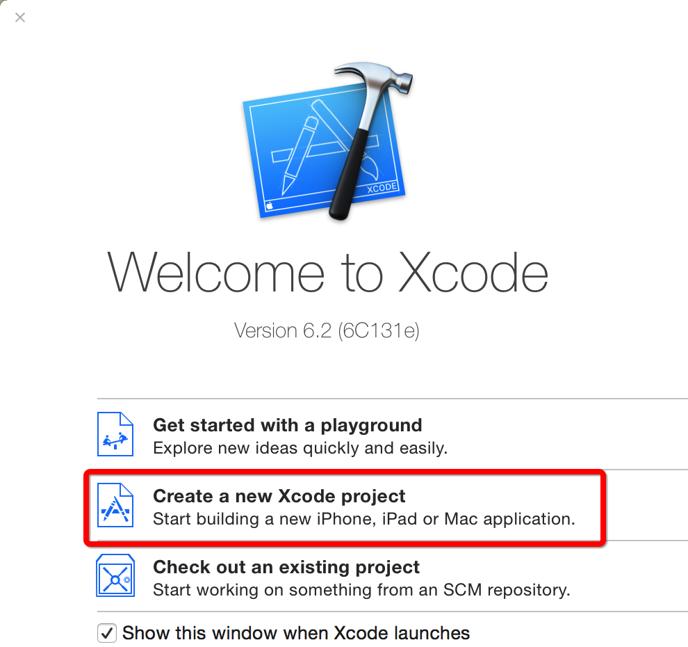
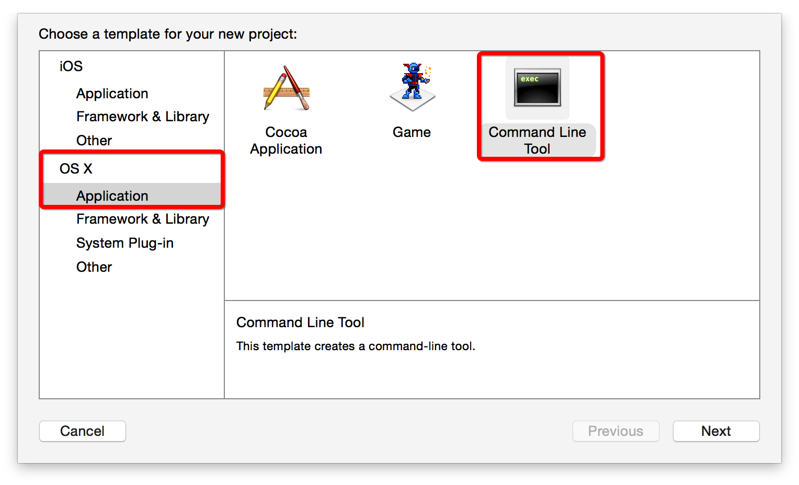

# 创建C工程

为了方便，我们直接使用集成开发环境Xcode来进行C语言的学习。以下介绍的方法，均是Xcode，如果有使用VS，VC++ 6.0的读者可以百度下“如何创建C工程”。

1.打开Xcode，选择Create a New Xcode Project

2.选择OS下的Application -> Command Line Tools

3.填写相关信息

4.选择保存路径 -> 创建
