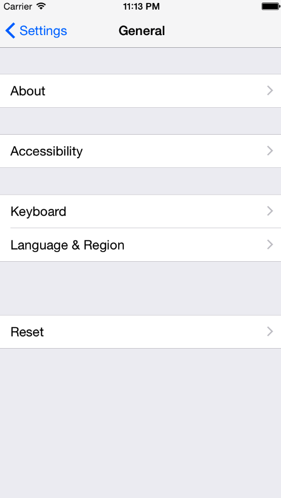
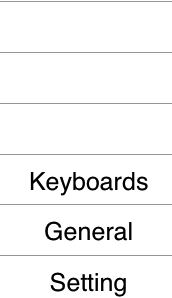

# 栈

栈是计算机中一种特殊的串列形式的数据结构（队列也是）。可以把它想象成数组。

##栈的特点

LIFO：(last in first out)，后进先出原则。栈永远操作最上面的元素。

举个例子，桌子上的一摞书，后放上去，先取下来。

##专业术语

- 栈顶：栈的顶部。
- 栈底：栈的底部。
- 栈顶元素：栈最顶部的元素。
- 栈底元素：栈最底部的元素。
- 入栈（压栈 push）：将元素放入栈顶。
- 出栈（pop）：将栈顶元素移除。

##实际应用

在iOS开发中，有一个控件叫做导航栏控制器(`UINavigationController`)，其中有两个方法push与pop就是对栈的操作。

打开iPhone的设置界面，此时的栈中有一个栈底元素Setting页面（同时也是栈顶）：

当点击General页面，此时General页面会进行入栈操作，成为新的栈顶元素：

继续点击Keyboards页面，此时的Keyboard页面也会进行入栈，成为栈顶元素：

当点击返回按钮以后，首先推出Keyboard页面，再次返回，推出General页面，很明显，这是一个先进后出的模式，所以可以说明，这是一个栈的操作。在实际的方法调用中，我们将Setting->General称为界面从Setting push 到了General，返回时，成为将General pop推出了。

##栈的实现

