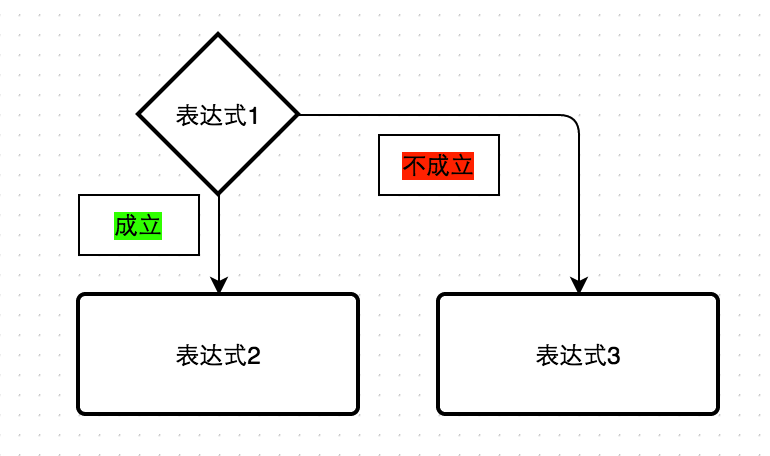

# 运算符

- [算术运算符](#1)
- [三目运算符](#5)
- [关系运算符](#2)
- [逻辑运算符](#3)
- [位运算符](#4)
- [逗号运算符](#6)

<span id='1'></span>
## 算术运算符

算术运算符在小学的时候已经运用得炉火纯青了，主要包含：

```
+（加）   -（减）  *（乘）  /（除）   %（取余/取模）  
```

剩下的两个需要<font color='red'>特别</font>注意：

```
++（自增）   --（自减）
```

### 自增与自减

遵循Talk is cheap, show me code的原则，先上代码：

```c
int i = 4;

i--;
printf("i = %d", i); // 输出 i = 3

i++;
printf("i = %d", i); // 输出 i = 4
```
所以

`i++;`的含义是`i = i + 1;`

`i--;`的含义是`i = i - 1;`

他们与`i + 1`和`i - 1`的区别是他们有一个赋值的过程（即，i的值会发生改变）

### 自增自减中运算与赋值的先后顺序

记住一句话：++在前，先运算，后赋值；++在后，先赋值，后运算。（自减也一样）

通过代码来看看是什么意思：

```c
int i = 4;
int j = i--;
// --在后，所以先将i赋值给j，然后i再-1
printf("i = %d, j = %d", i, j); // 输出 i = 3, j = 4

int a = 4;
int b = --i;
// --在前，所以i先-1，然后再将i赋值给j
printf("a = %d, b = %d", a, b); // 输出 a = 3, b = 3
```

<span id='5'></span>
## 三目运算符

有三个操作数的运算符，条件运算符中常见的是：

```
表达式1 ? 表达式2 : 表达式3
```

意思是如果表达式1成立，就返回表达式2的值，如果不成立就返回表达式3的值。



例：

```c
int a = 1;
int b = a > 5 ? 10 : 20;
printf("b = %d", b); // 输出20
```

练习：

```
用三目运算符求三个数的最大值。
```

<span id='2'></span>
## 关系运算符

关系运算符即表达两个操作数关系的运算符。

```
>（大于）  <（小于） >=（大于等于）  <=（小于等于）  ==（等于）  !=（不等于）
```

<span id='3'></span>
## 逻辑运算符

表达真假的运算符。

```
&&（与）  ||（或）  !（非）
```

运用：

```c
int a = 1;
printf("!a = %d\n", !a); // 输出0

int b = 3, c = 10;
printf("b && c = %d\n", b && c); // 输出1

int d = 3, e = 0;
printf("d && e = %d\n", d && e); // 输出0

int f = 3, g = 10;
printf("f || g = %d\n", f || g); // 输出1

int h = 3, i = 0;
printf("h || i = %d\n", h || i); // 输出1
```

从上面的结果可以看出这几个逻辑运算符的特点：

- !（非）：`!真 = 假`；`!假 = 真`
- &&（与）：有0则0
- ||（或）：有1则1

其中&&（与）和||（或）需要特别注意一点：<font color=red>短路现象</font>。

- 在与运算中，如果前面的表达式为<font color=red>假</font>，则不执行后面的表达式
- 在或运算中，如果前面的表达式为<font color=red>真</font>，则不执行后面的表达式

```c
int a = 10, b = 20;
a < 10 && b++;
printf("a = %d, b = %d", a, b); // 输出a = 10, b = 20

// 同理
a < 10 || b++;
printf("a = %d, b = %d", a, b); // 输出a = 10, b = 21
```

<span id='4'></span>
## 位运算符

位运算符是将数据转换成二进制，然后按比特位进行运算的运算符。

### 位逻辑运算符

```
|（按位或）  &（按位与）  ~（按位取反）  ^（按位异或）
```
例：

```c
int a = 5 | 3;
/* 表示为：
   101
   011
---------
   111
*/
printf("a = %d", a); // 输出 a = 7
```

### 移位运算符

```
>>（右移）  <<（左移）
```
例：

```c
int a = 3 << 2;
/*
表示为：
3的二进制表示为：011
3 << 2的含义是：将3向左移2位，表示为：01100
所以其实3被放大了2^2
*/
printf("a = %d", a); // 输出a = 12
```
根据上面的例子可以得出结论：

- <<（左移）：放大2^n倍
- >>（右移）：缩小2^n倍

当然，位运算还有很多的运算符，如自反赋值运算等等，可以自行了解，这里并不是重点。

<span id='6'></span>
## 逗号运算符

C语言中，多个表达式可以用逗号分开，其中用逗号分开的表达式的值分别结算，但整个表达式的值是最后一个表达式的值。逗号运算符优先级最低。

例：

```c
int a = 10, b = 20;
int x, y;
x = (a++, b);
y = (x = x + 1, 10);
printf("x = %d, y = %d, a = %d, b = %d", x, y, a, b); // 输出x = 21, y = 10, a = 11, b = 20
```